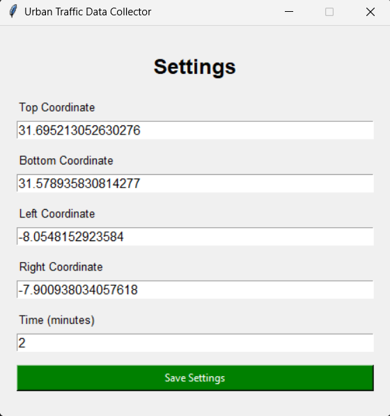
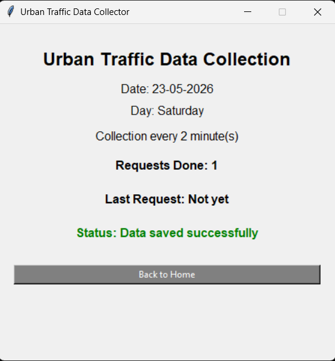

# Urban Traffic Data Collector

Urban Traffic Data Collector is a Python desktop application designed to automatically collect real-time urban traffic information from Waze.

The application periodically retrieves traffic data including:

- Traffic jams
- Accidents
- Road hazards
- Police reports
- Road closures

The collected data are automatically stored in a MySQL database for historical analysis, smart city research, urban mobility studies, and road safety applications.

---

# Features

- Automatic Waze traffic data collection
- Automatic Waze token refresh using Playwright
- Configurable collection area using geographic coordinates
- Periodic data collection
- MySQL database storage
- Historical traffic database
- Traffic alerts collection
- Traffic jams collection
- Desktop GUI using Tkinter
- Automatic retry when token expires

---

# Project Structure

```text
project/
│── app.py
│── db.py
│── waze.py
│── requirements.txt
│── settings.txt
│── token.txt
│── README.md
```

---

# Requirements

- Python 3.10+
- MySQL Server (XAMPP recommended)
- Google Chrome / Chromium
- Internet connection

---

# Installation

## 1. Clone the project

```bash
git clone https://github.com/charef00/Urban-Traffic-Data-Collector.git
cd urban-traffic-data-collector
```

Or simply download the ZIP file.

---

## 2. Create Python virtual environment

### Windows

```bash
python -m venv venv
```

Activate environment:

```bash
venv\Scripts\activate
```

### Linux / MacOS

```bash
python3 -m venv venv
source venv/bin/activate
```

---

## 3. Install requirements

```bash
pip install -r requirements.txt
```

---

## 4. Install Playwright browser

Playwright requires browser installation:

```bash
playwright install
```

---

# MySQL Configuration

Open MySQL (XAMPP → phpMyAdmin or MySQL terminal).

Create database:

```sql
CREATE DATABASE waze_db;
```

Use database:

```sql
USE waze_db;
```

---

# Create Tables

Run the following SQL:

## Alerts Table

```sql
CREATE TABLE IF NOT EXISTS alerts (

    id VARCHAR(255) PRIMARY KEY,

    type VARCHAR(100),
    subtype VARCHAR(100),

    street TEXT,

    latitude DOUBLE,
    longitude DOUBLE,

    n_comments INT DEFAULT 0,
    n_thumbs_up INT DEFAULT 0,

    comments JSON,

    report_description TEXT,
    report_by VARCHAR(255),

    pub_millis BIGINT,

    pub_datetime DATETIME,
    age_minutes DOUBLE,

    raw_json JSON,

    created_at TIMESTAMP DEFAULT CURRENT_TIMESTAMP
);
```

---

## Jams Table

```sql
CREATE TABLE IF NOT EXISTS jams (

    id BIGINT PRIMARY KEY,

    street TEXT,
    city VARCHAR(255),

    level INT,
    length DOUBLE,
    speed DOUBLE,

    end_node TEXT,

    latitude DOUBLE,
    longitude DOUBLE,

    update_millis BIGINT,

    update_datetime DATETIME,
    age_minutes DOUBLE,

    line JSON,
    segments JSON,

    cause_alert JSON,

    cause_type VARCHAR(100),
    cause_subtype VARCHAR(100),
    report_by VARCHAR(255),

    confidence INT,
    reliability INT,

    raw_json JSON,

    created_at TIMESTAMP DEFAULT CURRENT_TIMESTAMP
);
```

---

# Configure Database Connection

Open:

```text
db.py
```

Edit MySQL credentials:

```python
def connect_db():

    return mysql.connector.connect(
        host="localhost",
        user="root",
        password="",
        database="waze_db"
    )
```

Example:

```python
def connect_db():

    return mysql.connector.connect(
        host="localhost",
        user="root",
        password="your_password",
        database="waze_db"
    )
```

Parameters:

- `host` → MySQL server address
- `user` → MySQL username
- `password` → MySQL password
- `database` → database name

---

# Configure Collection Settings

When opening the application:

1. Click **Edit Settings**
2. Add:

- Top coordinate
- Bottom coordinate
- Left coordinate
- Right coordinate
- Collection interval (minutes)

Example for Marrakech:

```text
Top: 31.695213052630276
Bottom: 31.578935830814277
Left: -8.0548152923584
Right: -7.900938034057618
Time: 5
```

These settings are automatically saved inside:

```text
settings.txt
```

---

# How to Run

Run:

```bash
python app.py
```

The graphical interface will open.

---

# How to Use the Application

### Step 1 — Configure settings

Click:

```text
Edit Settings
```

Enter:

- Geographic coordinates
- Collection interval

Save settings.

---

### Step 2 — Start collection

Click:

```text
Start Collecting
```

The application will:

1. Retrieve Waze token automatically
2. Connect to Waze API
3. Fetch urban traffic data
4. Store alerts into MySQL
5. Store jams into MySQL
6. Repeat every configured interval

---
# Application Interface

The application provides a simple graphical interface for configuring and monitoring Waze traffic data collection.

---

## Home Interface

The main page allows users to:

- Start traffic data collection
- Open and edit collection settings


---

## Settings Interface

The settings page allows users to configure:

- Top coordinate
- Bottom coordinate
- Left coordinate
- Right coordinate
- Collection interval (minutes)

These settings define the geographic bounding box used for Waze traffic collection.

Example configuration for Marrakech:

- Top: `31.695213052630276`
- Bottom: `31.578935830814277`
- Left: `-8.0548152923584`
- Right: `-7.900938034057618`



---

## Collection Interface

Once data collection starts, the application automatically:

- Fetches Waze traffic data
- Stores alerts and jams into MySQL
- Updates request statistics
- Displays collection status

The interface shows:

- Current date
- Day name
- Collection interval
- Number of requests completed
- Last request time
- Current system status


# Stored Data

## Alerts Table

Contains:

- Accident reports
- Police reports
- Hazards
- Road closures
- Comments
- Coordinates
- Time information

---

## Jams Table

Contains:

- Congestion level
- Speed
- Jam length
- Street information
- Cause of congestion
- Coordinates
- Update timestamps

---

# Automatic Token Refresh

If Waze token expires:

```text
403 Forbidden
```

The application automatically:

1. Opens Waze using Playwright
2. Collects a new token
3. Retries the request

No manual action is required.

---

# Research Applications

This software can be used for:

- Smart city research
- Urban traffic analysis
- Motorcycle safety analysis
- Accident hotspot detection
- Traffic congestion studies
- Machine learning datasets
- Power BI dashboards

---

# License

This project is licensed under the MIT License.

You are free to:

- Use
- Copy
- Modify
- Merge
- Publish
- Distribute
- Sublicense
- Sell copies of the software

under the conditions specified in the LICENSE file.

© 2026 Ayoub CHAREF
